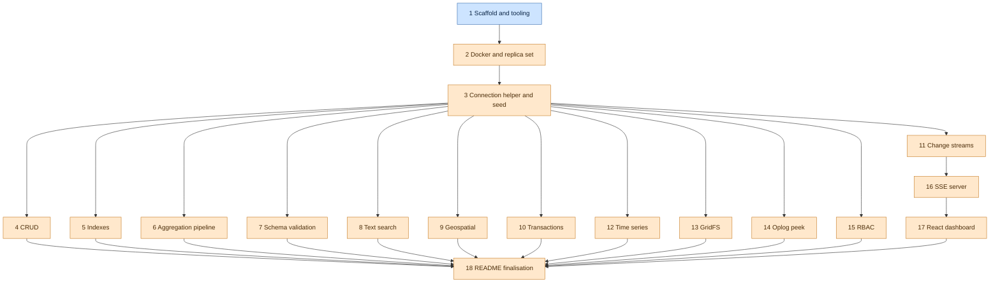

# Architecture

How the Mongo playground is wired together. Per-deliverable detail lives under
[docs/modules](./modules); this file is the cross-cutting view.

## Dependency graph

The deliverable build order, derived from the `depends_on` field of each
deliverable in [docs/deliverables.md](./deliverables.md). Roots with no
dependencies are one colour, dependents another.

<!-- depgraph -->

<!-- /depgraph -->

## Connection and seed layer

The single point of database access and the deterministic data the rest of the
harness builds on. See the module doc:
[3-connection-helper-and-seed](./modules/3-connection-helper-and-seed.md).

### Single shared MongoClient

[`src/db.ts`](../src/db.ts) owns one `MongoClient` per process, cached in a
module-level variable and handed out by `getClient()`. Construction is lazy, the
driver touches no network until `connect()`, so the getter is unit testable for
reuse with the database down. `getDb()` connects that one client and returns a
typed `Db` on `DB_NAME` (`mongodb1`); `closeClient()` closes and clears it so a
later `getClient()` rebuilds and the process can exit. Every module imports these,
none constructs its own client or connects per query. The URI carries
`directConnection=true` because a single node replica set advertises its internal
container hostname which the host cannot resolve.

### Centralised collection names and shared interfaces

[`src/collections.ts`](../src/collections.ts) is the only place collection names
and document shapes are declared. `COLLECTIONS` holds the name constants and the
`GeoPoint`, `User`, `Place` and `Post` interfaces define the document shapes,
passed as driver generics (`db.collection<User>(COLLECTIONS.users)`). Modules
import these rather than hardcoding name strings or redefining shapes, so a rename
or a shape change is one edit.

### Faker seed

[`src/seed.ts`](../src/seed.ts) generates seed data with faker rather than
shipping a static dump. `seedAll()` sets a fixed faker seed (1337) so counts and
any sampled document are stable for tests, then drops each collection before
inserting so re-running is idempotent and leaves exactly `SEED_COUNTS`
(users 25, places 15, posts 40). It returns the counts and leaves the client open,
the caller owns the lifecycle. Run it with `npm run seed` or `make seed`.

## Example modules

Each feature lives in one file under [`src/examples`](../src/examples), runnable on
its own via an `ex:<feature>` npm script and printing its results. Modules import
the shared client from [`src/db.ts`](../src/db.ts) and collection names from
[`src/collections.ts`](../src/collections.ts), they never connect per query or
hardcode a name. A module that mutates data works in its own scratch collection so
it never corrupts the seed the other modules read.

### CRUD

The core create, read, update and delete operations. See the module doc:
[4-crud](./modules/4-crud.md). [`src/examples/crud.ts`](../src/examples/crud.ts)
covers insertOne, insertMany, find with a filter and a projection, updateOne,
updateMany, upsert, deleteOne and deleteMany against a dedicated `widgets`
collection, run with `npm run ex:crud`. Because it deletes and mutates, it uses
its own scratch collection rather than the seeded `users`, `places` and `posts`,
its tests drop that collection before each case so they are order independent.

### Indexes

Compound, partial and TTL indexes, with explain proving the planner uses them. See
the module doc: [5-indexes](./modules/5-indexes.md).
[`src/examples/indexes.ts`](../src/examples/indexes.ts) builds the three indexes on
a dedicated `metrics` scratch collection and exposes helpers that explain a query
and walk the winning plan, run with `npm run ex:indexes`. The real gate is the
explain stage: a recursive walk of the winning plan asserts an IXSCAN is present
and a COLLSCAN is absent, so the test fails if an index is dropped or ignored. The
partial index is proven by hinting it and showing the documents outside its filter
are absent, and the TTL index is asserted by its recorded `expireAfterSeconds`
rather than by waiting for the background monitor to delete.

<!-- 6 -->

## Aggregation pipeline

The core aggregation stages over two related collections. See the module doc:
[6-aggregation](./modules/6-aggregation.md).
[`src/examples/aggregation.ts`](../src/examples/aggregation.ts) exercises $match,
$group, $sort, $project, $lookup, $unwind, $facet and $bucket against dedicated
`orders` and `customers` scratch collections, run with `npm run ex:aggregation`.
The collections carry hand-authored deterministic data rather than the faker seed,
because the acceptance criteria demand concrete numbers a wrong pipeline would not
produce, so every total, count and bucket is computable by hand. $lookup needs a
second related collection, hence two: orders join to customers by `customerId`, and
the joined region is projected flat to confirm the related fields arrived.

The seed is shaped so the assertions gate the pipeline, not just the result length.
The cancelled order carries the largest amount and one customer owns no orders, so a
broken pre-group $match or an over-eager $group changes the asserted numbers. Every
helper needs live Mongo, so the module is integration tier only.

<!-- /6 -->

<!-- 7 -->

## Schema validation

A collection `$jsonSchema` validator with `validationLevel: 'strict'` and
`validationAction: 'error'`. See the module doc:
[7-validation](./modules/7-validation.md).
[`src/examples/validation.ts`](../src/examples/validation.ts) recreates a `members`
scratch collection carrying the validator, then inserts one conforming member and one
crafted to violate the schema, run with `npm run ex:validation`. The rule lives on
the collection, not in application code, so the rejection is a MongoServerError from
the write itself, raised with code 121 (`DocumentValidationFailure`).

Two key decisions shape the validator. `age` is `bsonType: 'number'` rather than
`int`, because the Node driver serialises a plain JS number as BSON double, so a
strict `int` validator would reject a conforming age while a `minimum` constraint
still gates out-of-range values. The reject test asserts on `code === 121` and
`errInfo.details.operatorName === '$jsonSchema'` rather than `codeName`, because this
driver version does not populate `codeName` on the validation error. Every helper
needs live Mongo, so the module is integration tier only.

<!-- /7 -->

<!-- 8 -->

## Text search

A text index and a `$text` query that ranks matches by relevance. See the module
doc: [8-text-search](./modules/8-text-search.md).
[`src/examples/text.ts`](../src/examples/text.ts) builds a single text index over
`title` and `body` on a dedicated `articles` scratch collection, then runs a search
that projects the textScore meta and sorts by it descending, run with
`npm run ex:text`. A collection may carry at most one text index, so the one index
spans both fields, and it is stored as `weights` ({ title: 1, body: 1 }) rather than
literal `'text'` keys, which is what the index test asserts on.

The corpus is hand-authored and deterministic rather than the faker seed, because
the test must know which documents match and in what order. One document repeats the
term so it outscores a single mention, and two never mention it so a $text match must
exclude them. The relevance score lives only in the `{ $meta: 'textScore' }`
projection, so it is projected to be sortable and returned, and the gate is the
ordering: a broken sort ranks the wrong document first. Every query needs live Mongo,
so the module is integration tier only, with the pure `isDescending` predicate
covered in the unit tier.

<!-- /8 -->

<!-- 9 -->

## Geospatial

A 2dsphere index with a near and a within query. See the module doc:
[9-geospatial](./modules/9-geospatial.md).
[`src/examples/geo.ts`](../src/examples/geo.ts) builds a named 2dsphere index over
`location` on a dedicated `landmarks` scratch collection, then runs a `$geoNear`
aggregation that returns the landmarks nearest first with the computed distance and
a `$geoWithin` + `$centerSphere` query that returns only the points inside a circle,
run with `npm run ex:geo`. `$geoNear` is used over `find()` + `$near` because its
`distanceField` surfaces the spherical distance, so the test asserts ordering by an
increasing value rather than just document order. It must be the first pipeline
stage and the index is built in `resetAndSeed` before any query runs, since
`$geoNear` errors without it.

The corpus is five hand-authored London landmarks rather than the faker-seeded
`places`, because random points cannot give a provable nearest-first order or a
known inside or outside split. They sit at strictly increasing distances from a
fixed origin and Greenwich falls outside the radius, so the within query has a point
it must exclude. Coordinates are `[longitude, latitude]`, longitude first, chosen so
a swap moves every point and is caught by the tests, and the `$centerSphere` radius
is pre-converted to radians as Mongo expects. The near and within queries need live
Mongo, so the module is integration tier only, with the pure `haversineMetres` and
`isAscending` predicates covered in the unit tier.

<!-- /9 -->

<!-- 10 -->

## Transactions

A multi-document transaction demonstrating commit and abort with a conserved total.
See the module doc: [10-transactions](./modules/10-transactions.md).
[`src/examples/transactions.ts`](../src/examples/transactions.ts) seeds two fixed
accounts on a dedicated `accounts` scratch collection, then transfers between them
with a guarded debit and a credit inside one `client.withSession` +
`session.withTransaction`, both writes passing `{ session }`, run with
`npm run ex:transactions`. The driver-owned `withSession` and `withTransaction` are
used over a manual `startSession` / `commitTransaction`, so the driver owns the
commit, the retry of transient errors and the session lifecycle, and a thrown error
inside the callback aborts cleanly with nothing to leak.

The transfer either commits both writes or aborts both: a forced mid-transaction
`ForcedAbort` rolls the staged debit back, and an overdraw matches no document under
the `balance >= amount` debit guard so it aborts before the credit lands. The sum of
all balances is the conserved invariant the tests assert across both outcomes. The
collection comes from the named `getDb()` handle, not `client.db()`, since the URI
declares no default database. The transfer needs live Mongo, so the behavioural
tests are integration tier only, with the seed-shape assertions in the unit tier.

<!-- /10 -->
