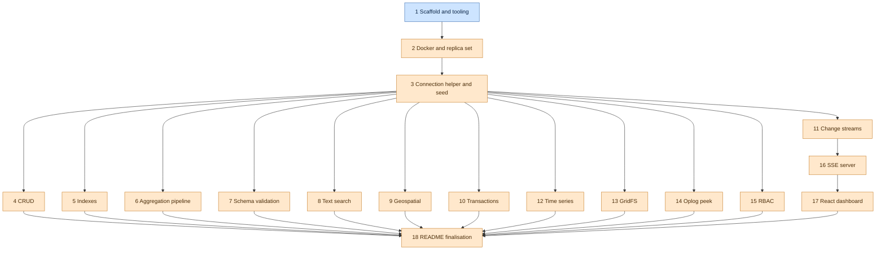

# Architecture

How the Mongo playground is wired together. Per-deliverable detail lives under
[docs/modules](./modules); this file is the cross-cutting view.

## Dependency graph

The deliverable build order, derived from the `depends_on` field of each
deliverable. Roots with no dependencies are one colour, dependents another.

<!-- depgraph -->

<!-- /depgraph -->

## Connection and seed layer

The single point of database access and the deterministic data the rest of the
harness builds on. See the module doc:
[3-connection-helper-and-seed](./modules/3-connection-helper-and-seed.md).

### Single shared MongoClient

[`src/db.ts`](../src/db.ts) owns one `MongoClient` per process, cached in a
module-level variable and handed out by `getClient()`. Construction is lazy, the
driver touches no network until `connect()`, so the getter is unit testable for
reuse with the database down. `getDb()` connects that one client and returns a
typed `Db` on `DB_NAME` (`mongodb1`); `closeClient()` closes and clears it so a
later `getClient()` rebuilds and the process can exit. Every module imports these,
none constructs its own client or connects per query. The URI carries
`directConnection=true` because a single node replica set advertises its internal
container hostname which the host cannot resolve.

### Centralised collection names and shared interfaces

[`src/collections.ts`](../src/collections.ts) is the only place collection names
and document shapes are declared. `COLLECTIONS` holds the name constants and the
`GeoPoint`, `User`, `Place` and `Post` interfaces define the document shapes,
passed as driver generics (`db.collection<User>(COLLECTIONS.users)`). Modules
import these rather than hardcoding name strings or redefining shapes, so a rename
or a shape change is one edit.

### Faker seed

[`src/seed.ts`](../src/seed.ts) generates seed data with faker rather than
shipping a static dump. `seedAll()` sets a fixed faker seed (1337) so counts and
any sampled document are stable for tests, then drops each collection before
inserting so re-running is idempotent and leaves exactly `SEED_COUNTS`
(users 25, places 15, posts 40). It returns the counts and leaves the client open,
the caller owns the lifecycle. Run it with `npm run seed` or `make seed`.

## Example modules

Each feature lives in one file under [`src/examples`](../src/examples), runnable on
its own via an `ex:<feature>` npm script and printing its results. Modules import
the shared client from [`src/db.ts`](../src/db.ts) and collection names from
[`src/collections.ts`](../src/collections.ts), they never connect per query or
hardcode a name. A module that mutates data works in its own scratch collection so
it never corrupts the seed the other modules read.

### CRUD

The core create, read, update and delete operations. See the module doc:
[4-crud](./modules/4-crud.md). [`src/examples/crud.ts`](../src/examples/crud.ts)
covers insertOne, insertMany, find with a filter and a projection, updateOne,
updateMany, upsert, deleteOne and deleteMany against a dedicated `widgets`
collection, run with `npm run ex:crud`. Because it deletes and mutates, it uses
its own scratch collection rather than the seeded `users`, `places` and `posts`,
its tests drop that collection before each case so they are order independent.

### Indexes

Compound, partial and TTL indexes, with explain proving the planner uses them. See
the module doc: [5-indexes](./modules/5-indexes.md).
[`src/examples/indexes.ts`](../src/examples/indexes.ts) builds the three indexes on
a dedicated `metrics` scratch collection and exposes helpers that explain a query
and walk the winning plan, run with `npm run ex:indexes`. The real gate is the
explain stage: a recursive walk of the winning plan asserts an IXSCAN is present
and a COLLSCAN is absent, so the test fails if an index is dropped or ignored. The
partial index is proven by hinting it and showing the documents outside its filter
are absent, and the TTL index is asserted by its recorded `expireAfterSeconds`
rather than by waiting for the background monitor to delete.

<!-- 6 -->

## Aggregation pipeline

The core aggregation stages over two related collections. See the module doc:
[6-aggregation](./modules/6-aggregation.md).
[`src/examples/aggregation.ts`](../src/examples/aggregation.ts) exercises $match,
$group, $sort, $project, $lookup, $unwind, $facet and $bucket against dedicated
`orders` and `customers` scratch collections, run with `npm run ex:aggregation`.
The collections carry hand-authored deterministic data rather than the faker seed,
because the acceptance criteria demand concrete numbers a wrong pipeline would not
produce, so every total, count and bucket is computable by hand. $lookup needs a
second related collection, hence two: orders join to customers by `customerId`, and
the joined region is projected flat to confirm the related fields arrived.

The seed is shaped so the assertions gate the pipeline, not just the result length.
The cancelled order carries the largest amount and one customer owns no orders, so a
broken pre-group $match or an over-eager $group changes the asserted numbers. Every
helper needs live Mongo, so the module is integration tier only.

<!-- /6 -->

<!-- 7 -->

## Schema validation

A collection `$jsonSchema` validator with `validationLevel: 'strict'` and
`validationAction: 'error'`. See the module doc:
[7-validation](./modules/7-validation.md).
[`src/examples/validation.ts`](../src/examples/validation.ts) recreates a `members`
scratch collection carrying the validator, then inserts one conforming member and one
crafted to violate the schema, run with `npm run ex:validation`. The rule lives on
the collection, not in application code, so the rejection is a MongoServerError from
the write itself, raised with code 121 (`DocumentValidationFailure`).

Two key decisions shape the validator. `age` is `bsonType: 'number'` rather than
`int`, because the Node driver serialises a plain JS number as BSON double, so a
strict `int` validator would reject a conforming age while a `minimum` constraint
still gates out-of-range values. The reject test asserts on `code === 121` and
`errInfo.details.operatorName === '$jsonSchema'` rather than `codeName`, because this
driver version does not populate `codeName` on the validation error. Every helper
needs live Mongo, so the module is integration tier only.

<!-- /7 -->

<!-- 8 -->

## Text search

A text index and a `$text` query that ranks matches by relevance. See the module
doc: [8-text-search](./modules/8-text-search.md).
[`src/examples/text.ts`](../src/examples/text.ts) builds a single text index over
`title` and `body` on a dedicated `articles` scratch collection, then runs a search
that projects the textScore meta and sorts by it descending, run with
`npm run ex:text`. A collection may carry at most one text index, so the one index
spans both fields, and it is stored as `weights` ({ title: 1, body: 1 }) rather than
literal `'text'` keys, which is what the index test asserts on.

The corpus is hand-authored and deterministic rather than the faker seed, because
the test must know which documents match and in what order. One document repeats the
term so it outscores a single mention, and two never mention it so a $text match must
exclude them. The relevance score lives only in the `{ $meta: 'textScore' }`
projection, so it is projected to be sortable and returned, and the gate is the
ordering: a broken sort ranks the wrong document first. Every query needs live Mongo,
so the module is integration tier only, with the pure `isDescending` predicate
covered in the unit tier.

<!-- /8 -->

<!-- 9 -->

## Geospatial

A 2dsphere index with a near and a within query. See the module doc:
[9-geospatial](./modules/9-geospatial.md).
[`src/examples/geo.ts`](../src/examples/geo.ts) builds a named 2dsphere index over
`location` on a dedicated `landmarks` scratch collection, then runs a `$geoNear`
aggregation that returns the landmarks nearest first with the computed distance and
a `$geoWithin` + `$centerSphere` query that returns only the points inside a circle,
run with `npm run ex:geo`. `$geoNear` is used over `find()` + `$near` because its
`distanceField` surfaces the spherical distance, so the test asserts ordering by an
increasing value rather than just document order. It must be the first pipeline
stage and the index is built in `resetAndSeed` before any query runs, since
`$geoNear` errors without it.

The corpus is five hand-authored London landmarks rather than the faker-seeded
`places`, because random points cannot give a provable nearest-first order or a
known inside or outside split. They sit at strictly increasing distances from a
fixed origin and Greenwich falls outside the radius, so the within query has a point
it must exclude. Coordinates are `[longitude, latitude]`, longitude first, chosen so
a swap moves every point and is caught by the tests, and the `$centerSphere` radius
is pre-converted to radians as Mongo expects. The near and within queries need live
Mongo, so the module is integration tier only, with the pure `haversineMetres` and
`isAscending` predicates covered in the unit tier.

<!-- /9 -->

<!-- 10 -->

## Transactions

A multi-document transaction demonstrating commit and abort with a conserved total.
See the module doc: [10-transactions](./modules/10-transactions.md).
[`src/examples/transactions.ts`](../src/examples/transactions.ts) seeds two fixed
accounts on a dedicated `accounts` scratch collection, then transfers between them
with a guarded debit and a credit inside one `client.withSession` +
`session.withTransaction`, both writes passing `{ session }`, run with
`npm run ex:transactions`. The driver-owned `withSession` and `withTransaction` are
used over a manual `startSession` / `commitTransaction`, so the driver owns the
commit, the retry of transient errors and the session lifecycle, and a thrown error
inside the callback aborts cleanly with nothing to leak.

The transfer either commits both writes or aborts both: a forced mid-transaction
`ForcedAbort` rolls the staged debit back, and an overdraw matches no document under
the `balance >= amount` debit guard so it aborts before the credit lands. The sum of
all balances is the conserved invariant the tests assert across both outcomes. The
collection comes from the named `getDb()` handle, not `client.db()`, since the URI
declares no default database. The transfer needs live Mongo, so the behavioural
tests are integration tier only, with the seed-shape assertions in the unit tier.

<!-- /10 -->

<!-- 11 -->

## Change streams

A change stream watched over a scratch collection, observing CRUD events and
resuming a closed stream from a stored token. See the module doc:
[11-change-streams](./modules/11-change-streams.md).
[`src/examples/change-streams.ts`](../src/examples/change-streams.ts) opens a
watch on a dedicated `events` scratch collection, inserts, updates and deletes one
fixed document and reads back the `operationType` of each event in order, run with
`npm run ex:change-streams`. The lazy server side cursor is forced open via
`tryNext()` before any write, because `watch()` only pins its start time on the
first server round trip and writes issued earlier would fall outside the window
and block `.next()` forever.

A second path captures the per-event resume token from the event `_id`, performs a
further write while no stream is open, then reopens with `resumeAfter` so the
post-token write is recovered and the captured event is not redelivered;
`fullDocument: 'updateLookup'` is requested only where a changed field is
asserted, since an update event otherwise carries only the change description. The
watch needs a live replica set, so the module is integration tier only, with the
fixture-shape assertions in the unit tier.

<!-- /11 -->

<!-- 12 -->

## Time series

A time series collection with a half-open time-window query. See the module doc:
[12-time-series](./modules/12-time-series.md).
[`src/examples/timeseries.ts`](../src/examples/timeseries.ts) creates a dedicated
`readings` scratch collection via `createCollection` with a `timeseries` option
(`timeField: 'timestamp'`, `metaField: 'sensorId'`, `granularity: 'minutes'`),
inserts six fixed-timestamp readings and runs a `[start, end)` query that returns
only the readings inside the window, run with `npm run ex:timeseries`.
`resetAndSeed` drops then recreates because the timeseries option cannot be added
to an existing collection, so a re-run on the existing name would otherwise error.
The timeField is a BSON `Date` because the server rejects an insert whose timeField
is any other type.

The six readings straddle the window: two fall before start, three fall inside and
one falls exactly on `end`. The query uses `$gte start, $lt end`, so the on-end
reading (value 15) is excluded by the exclusive upper bound, making the half-open
boundary observable: an inclusive `$lte` would leak it in and break the exact
expected-values assertion `[12, 13, 14]`. All readings share one `sensorId`, so the
window is the only thing that selects between them. Metadata is read back from
`listCollections` options, returning undefined for an ordinary collection so the
metadata test fails if it were created plain. Both queries need live Mongo, so the
module is integration tier only.

<!-- /12 -->

<!-- 13 -->

## GridFS

A file uploaded to a GridFS bucket and downloaded back, proven byte-for-byte
identical by a content hash. See the module doc: [13-gridfs](./modules/13-gridfs.md).
[`src/examples/gridfs.ts`](../src/examples/gridfs.ts) streams a fixed payload into a
GridFS bucket on a dedicated `files` bucket name, streams it back reassembled from
its chunks, and compares a sha256 digest of the download against a pinned expected
hash, run with `npm run ex:gridfs`. The round trip is gated on the content hash, not
a length, because a length check would pass a same-length corruption while a digest
catches a truncated or reordered stream. `EXPECTED_SHA256` is pinned as a literal so
the unit tier catches payload drift with the database down.

GridFS derives `files.files` and `files.chunks` from the single bucket name in
`COLLECTIONS`, so the bucket name is not itself a collection. The stream lifecycle is
wrapped in a Promise that rejects on `error` and resolves on `finish` or `end`, the
async/await bridge for event-based Node streams, and upload resolves before download
so there is no read-before-write race. The integration tier uploads a 700 KiB payload
spanning multiple 255 KiB chunks to exercise reassembly, where a dropped or reordered
chunk would change the hash. The round trip needs live Mongo, so the behavioural tests
are integration tier only, with the hash and corruption assertions in the unit tier.

<!-- /13 -->

<!-- 14 -->

## Oplog peek

A relative `$inc` update read back from the replication oplog to show it is
logged as a concrete absolute value, not the relative instruction. See the module
doc: [14-oplog](./modules/14-oplog.md).
[`src/examples/oplog.ts`](../src/examples/oplog.ts) seeds a single counter on a
dedicated `counters` scratch collection, sends a relative `$inc` to the server,
then reads the newest matching `local.oplog.rs` entry and shows its `$v:2` delta
holds the resulting total under `diff.u`, run with `npm run ex:oplog`. The oplog
is read via `getClient().db('local')`, not the harness `getDb()`, because the
oplog lives in the `local` system database, not `mongodb1`, while staying on the
one shared client.

The `$v:2` delta carries absolute values by design: replication must be
replay-safe, so a relative `$inc` is resolved to its result before logging, and
that is the idempotency property the module makes executable. The exact entry is
pinned by `op: 'u'`, the fully-qualified `ns` and `o2._id`, sorted
`$natural: -1` so a re-run cannot be mistaken for this one. Two pure predicates,
`deltaContainsInc` and `extractUpdatedValue`, are factored out so the unit tier
proves the idempotency check with no database and the integration tier reuses the
same definitions against a live oplog.

<!-- /14 -->

<!-- 15 -->

## RBAC

An illustrative tour of the role-based access control model on a scratch database,
honest that open localhost auth records grants but does not enforce them. See the
module doc: [15-rbac](./modules/15-rbac.md).
[`src/examples/rbac.ts`](../src/examples/rbac.ts) creates a user with a single
built-in `readWrite` role on a dedicated `rbac_scratch` database, reads the grant
back via `usersInfo`, and reads `connectionStatus` on the open connection, run with
`npm run ex:rbac`. A dedicated scratch database is used over the harness `mongodb1`
db so the user and grants never pollute the seeded collections other deliverables
assert on, and `RBAC_DB` is named in `collections.ts` but kept outside the
`COLLECTIONS` map because that map holds collection names, this is a db name.

Auth is open on localhost, so the grant is recorded not enforced: `createUser`
writes it to `system.users` and `usersInfo` reads it back, but no auth handshake
happens, so `connectionStatus` reports an empty `authenticatedUserRoles` on the
unauthenticated open connection. The module prints that caveat and the integration
test asserts the recorded grant and the honest empty value rather than a blocked
action or a faked session. The pure `rolesOf` and `hasRole` helpers are factored out
so the unit tier proves the recorded-grant extraction with the database down, while
the commands need live Mongo so the behavioural tests are integration tier only.

<!-- /15 -->

<!-- 16 -->

## SSE server

A Node http server holding one change stream and streaming each change to every
connected client over Server-Sent Events. See the module doc:
[16-sse](./modules/16-sse.md).
[`src/examples/sse.ts`](../src/examples/sse.ts) opens and establishes a single
`watch()` on its own `sseEvents` scratch collection, fans every event out to a
`Set` of open responses, and serves the stream at `/events`, run with
`npm run ex:sse`. One shared client and one stream serve the whole server lifetime,
not one per request, mirroring the dashboard-server rule, and the stream is
established with `tryNext()` before the server listens so a client that connects
then writes does not race the lazy cursor and miss its own event.

The server owns a dedicated `sseEvents` collection, separate from the
change-streams `events` collection, so the two modules' integration tests never
drop or watch the same collection concurrently under the parallel vitest file
runner. The streaming path needs a live replica set, so it is integration tier
only, with the pure `formatSseFrame` and `parseSseData` framing helpers in the unit
tier.

<!-- /16 -->

<!-- 17 -->

## React dashboard

A Vite React app consuming the SSE endpoint with EventSource and rendering a
live-updating table of change events. See the module doc:
[17-dashboard](./modules/17-dashboard.md). It is a self-contained sub-app under
[`dashboard/`](../dashboard) with its own DOM and JSX tsconfig, isolated from the
Node-only `src/` tree so the existing `npx tsc --noEmit` and the `src/` test tiers
stay untouched. Run `npm run dashboard:dev` against a running `npm run ex:sse`; the
dev server proxies `/events` to the deliverable 16 server on port 3000.

The deliverable gate is the pure data layer
[`dashboard/src/sseRows.ts`](../dashboard/src/sseRows.ts), which turns a raw
`data: {...}\n\n` frame into a table row and is unit tested against the deliverable
16 wire format, skipping the `: connected` comment frame. The EventSource wrapper
[`dashboard/src/sseClient.ts`](../dashboard/src/sseClient.ts) takes an injectable
factory and timer so the reconnect-on-drop behaviour is tested with a fake
connection, reconnecting only once the source is CLOSED and deferring the reopen
through a timer to avoid a tight loop. The dashboard's pure tests are folded into the
unit tier through a vitest projects config, so one `agent-tests.sh unit` run covers
both the `src/` Node tests and the dashboard jsdom tests.

<!-- /17 -->

<!-- 18 -->

## README finalisation

The full README that takes a new reader from a clean clone to every example running,
with a doc-check that keeps its quoted commands from drifting. See the module doc:
[18-readme](./modules/18-readme.md). [`README.md`](../README.md) documents the Make,
npm and faker split, the single node replica set and the `directConnection=true`
reason, the open auth posture, the vector search exclusion, and a feature index of
every example module and its npm script.

The gate is [`src/readme.integration.test.ts`](../src/readme.integration.test.ts),
which parses the README's own "Verified command set" block and runs each quoted
command, failing on the first non-zero exit, so the README cannot drift from the real
commands. Only self-terminating, non-destructive commands are in that block; the
bootstrap, the servers and the destructive make targets are documented in prose so
the doc-check, which itself runs in the integration tier, never tears down or hangs
the shared database. This is the terminal deliverable.

<!-- /18 -->

<!-- D1 -->

## CI and PR checks (D1)

A GitHub Actions workflow gates every pull request that targets `main`. It runs
five parallel jobs that reproduce the local quality gates: lint, format, typecheck
and the unit tier run database-free, while the integration job stands up the single
node replica set by reusing `make up` then runs seed and the integration tier. A
unit-tier structural test holds the workflow to its contract so the gates cannot
silently drift. See [docs/modules/D1-ci-workflow.md](./modules/D1-ci-workflow.md).

<!-- /D1 -->
